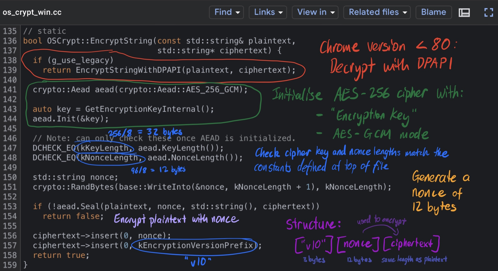
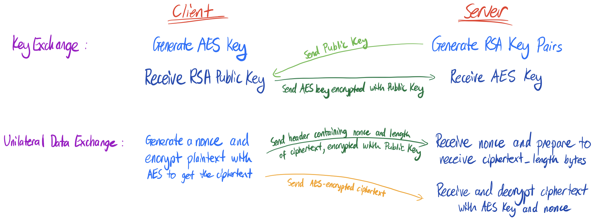

# KrwmTools

> **Tags:** Cryptography, Cyber Security, Spyware, Networking, Operating Systems, Reverse Engineering, SQL, Socket Programming


# Introduction and Rationale

For my Something Awesome security project, I decided to build a tool kit aimed at extracting sensitive data from Chromium browsers. My project was inspired by the [LaZagne Project](https://github.com/AlessandroZ/LaZagne), an open-source credentials recovery application which can be used to extract browser credentials as well as other passwords stored on Windows, macOS and Linux computers. KrwmTools focuses on Windows machines, extracting credentials, autofill information (fields, profiles, addresses, names, emails, phone numbers), credit card information, cookies and history (search terms and web history) from the ten most popular Chromium browsers, which could help build a profile for the users on a compromised computer. As detailed in my initial proposal, I had originally planned to create a password stealer only for the Google Chrome browser, working on all three operating systems. However, I decided to shift my focus to building a multi-purpose tool after realising the potential of other sensitive data which could be extracted as well, especially since there doesn't seem to be a similar utility available yet (on Google at least). My project is split into two sections: extracting the data, and securely sending the extracted data to a remote server (optional spyware functionality). 

> Git repository for source code and packaged Windows executable available at [https://github.com/axieax/krwm-tools](https://github.com/axieax/krwm-tools)

# Part 1: Chromium Data Extraction

## Part 1.1: Locating and extracting the credentials data

Due to issues with my MacBook, I was only able to start the project once my last PC part arrived so that I could finally assemble my Windows machine. Keeping in mind that I had initially only planned to extract credentials from the Google Chrome browser, I was able to quickly identify where the SQLite database for Login Data was stored (in the %APPDATA% directory) and use SQL queries learned from SQL Injection Wargames in the extension course, to learn more about how the data was stored. I discovered that the database would be locked with the browser being open, so I had to operate on a copy of the database file as a compromise. I kept this feature in my production code so that the browser did not have to be closed in order to extract data, and as will be discussed later, certain browsers like the Epic Privacy Browser used temporary databases which would be deleted upon exiting the browser. 

The Python code below is an extract of the reconnaissance attack I used to gain more information about the database structure for Login Data. 

```python
def sqli_recon(db_cursor) -> None:
    """ SQL queries to learn more about the database structure """
    # To find tables
    db_cursor.execute("SELECT name FROM sqlite_master WHERE type='table'")
    print(db_cursor.fetchall())
    # Table of interest: logins

    # To find columns for logins table
    db_cursor.execute('PRAGMA table_info(logins)')
    print([row[1] for row in db_cursor.fetchall()])
    # Columns of interest: action_url, username_value, password_value
```

Upon extracting the rows corresponding to credentials, I was surprised to see values for the action_url and username_value columns stored in plaintext, especially those associated with credentials that I remember saving on my MacBook's Chrome application, which indicated that I was heading in the right direction. Since I had only just set up my machine, I did not expect anything to turn up as I did not realise my credentials were also saved on my Google account, which is pretty convenient I suppose. 

## Part 1.2: Decrypting the data

As expected, the passwords were encrypted (thankfully!). From my research, it seemed that all I needed to do now was pass the encrypted passwords to Window's DPAPI (Data Protection API) for decryption, using the pywin32 Python package to make this Windows API call in Python. The DPAPI is a form of encryption at the operating system level which relies on the credentials of the user logged into the computer. Although it offers quite a strong form of encryption, it can be easily exploited using the attacker mindset on the same machine, where processes created by the same user are able to make these system calls without requiring knowledge of the user's login password. As a result, I am able to use this API to decrypt passwords which were encrypted with the same scheme without requiring user authentication once they are already logged into their computer, unlike the Chrome application where the user is prompted to enter their login password in order to view their stored passwords. 

However, once I had finally managed to install the Python dependency using another wrapper package (pypiwin32), I knew something was wrong when the passwords could not be decrypted using this approach. Having a look over my sources again, I noticed that they were quite outdated, ranging from 2013 to 2017. Doing some further research, I encountered [this article](https://hothardware.com/news/google-chrome-aes-256-password-encryption-malware-devs) which pointed that Chrome altered its encryption scheme for versions 80+ to AES-256, which was able to prevent the popular AZORult malware from stealing data from up-to-date Chrome users. This explained why I was unable to simply decrypt the passwords with DPAPI. Without much additional information on how the new encryption scheme worked, I resorted to analysing the open-source [Chromium source code](https://source.chromium.org/chromium/chromium/src) which Google Chrome was built on, in hopes of reverse engineering the password encryption process. 

After several hours of searching, I came across the [components/os_crypt/os_crypt_win.cc file](https://source.chromium.org/chromium/chromium/src/+/master:components/os_crypt/os_crypt_win.cc?q=DPAPI) written in C++ which seemed to contain what I was looking for. One of the functions of interest was the [OSCrypt::EncryptString function](https://source.chromium.org/chromium/chromium/src/+/master:components/os_crypt/os_crypt_win.cc;l=135?q=DPAPI). The annotated code extract below illustrates my findings regarding Chromium password encryption. I now knew which cipher was used to encrypt the passwords and the ciphertext structure for the passwords which I had just extracted. However, I was still unsure about two things: what was this "encryption key" and how does AES-GCM work?



Searching the code base for "EncryptionKey", I was able to find where encryption keys were stored and how they were encrypted, surprisingly within a constructor method for OSCrypt defined 30 lines below the extract above. I remembered seeing a Local State file when playing around with my Chrome data in %APPDATA%. Surely enough, I managed to locate the file and find a value for an "encrypted_key" key within the file's JSON-like structure. Loading the Local State file into Python and reversing the encryption process described below, I was able to successfully extract the encryption key and initialise my AES cipher. Although I didn't really understand what the different AES modes referred to, I was still able to plug in my extracted encryption key, nonce and ciphertext values into the cipher, and to my pleasant surprise (and relief after more than 10 hours spent looking through the Chromium codebase), see my actual password displayed on my screen, followed by some random bytes at the end. 


Up to this point, I still had not explored what the AES-GCM cipher was and how it worked. AES (Advanced Encryption Standard) is a strong encryption specification based on a symmetric-key algorithm, meaning it uses the same key for both encryption and decryption. Plaintext is converted to ciphertext through some byte permutation and substitution cipher, so both texts would have the same length. Since AES has a fixed block size of 128 bits or 16 bytes, the input may also need to be padded to ensure its length is a multiple of the block size. The AES-256 algorithm described refers to a key length of 256 bits or 32 bytes. GCM (Galois/Counter Mode) is an extension of CTR (counter) mode with GMAC (Galois Message Authentication Code) for authentication, where finite field arithmetic on the Galois field is used to authenticate the encryption. An integer counter is used in the encryption process for CTR mode, changing with each block of text when encrypting, before XOR'ing each block with the corresponding plaintext to obtain the ciphertext. The nonce, also commonly known as the initialisation vector, sets the starting state of the counter, affecting the encryption of all the following bytes. A different nonce should be used for encrypting different messages with the same key in order to prevent two-time pad attacks (Joux, 2006). An intercepting attacker can also recover the authentication key and use bitflip attacks to modify the integrity of the received payload (Wong, 2016). This is why Chrome uses a different nonce to encrypt each password. Although the nonce is stored in plaintext next to each encrypted password, this is still generally an accepted practice as simply using a different nonce prevents an attacker from working out information about the cipher and plaintexts using the ciphertexts. 

Following the function references, I was able to track down a reference to "additional data" or "authentication tag" which reminded me of the GMAC authentication used by the AES-GCM cipher, which I discovered was [hash defined](https://source.chromium.org/chromium/chromium/src/+/master:third_party/boringssl/src/crypto/fipsmodule/cipher/e_aes.c;l=886) to be of length 16 bytes. This explained the seemingly random sequence of bytes appended to my decrypted passwords. Since data integrity was not a major concern for password extraction, I was able to successfully extract all my saved passwords from the Google Chrome browser by ignoring the last 16 bytes. 

## Part 1.3: Extension to autofill information, cookies and history

Having successfully extracted credentials from Google Chrome, I revisited the directory containing my Chrome data to look for other files which could be exploited as well. Noticing the Cookies file reminded me of an extension topic where session tokens may be exploited through XSS attacks, so I tried my previous techniques of using SQL queries to learn more about the database structure before extracting and decrypting the data. From my previous source code analysis, I had a feeling that other sensitive data such as cookies would be encrypted in a similar way to credentials due to how general the os_crypt header file from before seemed for encrypting such data. Another file which caught my attention was the Web data file, where I noticed my address revealed in plaintext whilst scrolling through its contents. Once again, using SQL queries, I was able to find several tables of interest for autofill information from input fields and personal details to credit card information, before extracting these in a similar way to before. With an attacker mindset, I also decided to extract web and search history as they have the potential to reveal additional information about a client, such as what their interests are, their profession and when they work, as well as activity on sites such as Facebook. Unless they use incognito or private browsing mode, even clients using a VPN service to hide their presence can still have their activity tracked through this feature. With all this available information, an attacker is able to better build a profile about their client, and could more easily extort or target ads towards them for example. 

## Part 1.4: Extension to different Chromium browsers

Having successfully extracted these sensitive data from Google Chrome, I wanted to experiment on my included Microsoft Edge browser as well, since I knew it was also Chromium-based and would probably follow a similar method of data storage and encryption. I was able to similarly extract my Edge data by finding and altering the browser path in my code. I then tried installing the [most popular Chromium browsers](https://www.zdnet.com/pictures/all-the-chromium-based-browsers/), manually locating their %APPDATA% path and iterating through all such paths in my program, expecting a similar result to Google Chrome and Microsoft Edge. However, I found that there were several inconsistencies between different Chromium browsers in data storage methods as well as which specific data was encrypted. For example,

- Some browsers store certain fields in plaintext, while other browsers may choose to encrypt the same fields instead
  - e.g. Google Chrome stores autofill data in plaintext while Microsoft Edge stores them in ciphertext
- Some files were missing or temporary for certain browsers
  - e.g. Epic Privacy Browser deletes cookies and history upon exit
- Some browsers had different SQLite database structures
  - e.g. Epic Privacy Browser does not have the autofill_profile_addresses table
  - Blisk does not have a city column for the autofill_profile_addresses table

Furthermore, I found that some browsers supported multiple profiles with user-specific data stored under each profile, while other browsers such as Opera and Opera GX stored this data in a centralised location along with other browser configuration files. However, by further examining the raw data extracted from each browser's SQLite databases, I was able to generalise my program and successfully extract data from all Chromium browsers. 

## Part 1.5: Testing extraction

To test that data had been successfully extracted, I initially ran the program on several of my own Google Chrome profiles and on Microsoft Edge, providing me with expected results. I then downloaded and tried the other Chromium browsers, which worked as well. I also created a separate profile on my Windows PC to test that it works with multiple users on the same machine and to create the demo below, taking the time to make sure there is more stored data across the browsers. I have also tested the local data extraction of my program on the Windows partition of my MacBook, my parent's computers, as well as two of my friends, with their explicit permission of course. One of my friends was very surprised to see his many years of stored secrets be revealed right before his very eyes by simply running a .exe file. The other was a more security-minded peer who used Dashline as his password manager and a VPN when surfing the web. He mentioned that his autofill (such as name, address, phone numbers) and web history data were still exposed, which an attacker could still build a profile from and do social engineering with this information. 


# Part 2: Sending the Data to a Remote Server

## Part 2.1: Socket programming

Since I had originally planned to do a credentials stealer, I wanted to experiment with sending the data to a remote server as well, even though I have easily spent more than 50 hours on the first part already. Despite only initially planning to simply send the decrypted data to a server on localhost, I pushed myself to experiment with socket programming and set up a secure end-to-end encryption to a remote server. I found that setting up a Flask server and using the requests module to send the extracted data to the server only took a few minutes to set up, but was rather slow when sending the data. I remembered learning about TCP (Transmission Control Protocol) from the forensics extension topic, which could be used for server-client communication. Doing some additional research, I found that I could use Python to create a socket connection between the two processes, and send the data through the TCP connection created. As a topic I was interested in learning about, I decided to learn and implement socket programming in my project. I also switched from an attacker to a defender mindset, spending many hours devising a method of securing the stream of data being sent from the client to the server as I did not want the extracted data to be intercepted and read by an attacker.

## Part 2.2: Securing the stream with end-to-end encryption

My original implementation featured encrypting the data with a RSA cipher, generating a RSA key pair on the server and sending the public key to the client, who could then encrypt anything they wanted to send back to the server using the public key. By doing so, only the server with the private key could decrypt the message. However, I found several issues with this approach, including:

- A very long decryption process, especially for large amounts of data (the server would still be receiving and decrypting data 20 to 30 seconds after the client had finished encrypting and sending all their data over the socket)
- Messages had to be broken up into blocks to be encrypted and decrypted before being joined together due to the maximum plaintext length limited by the cipher (same length as the key in bytes)

Researching alternative methods, I found that symmetric ciphers are generally faster than asymmetric ones like the RSA, especially for encrypting and decrypting large amounts of data, with no theoretical limit to the maximum plaintext length. However, some ciphers required a padding to ensure that the plaintext is a multiple of a particular block size, such as the AES-GCM cipher I decided to use, which has a block size of 16 bytes. Interestingly, even though this was the same cipher used by Chromium browsers to encrypt sensitive data, it was also one of the more secure ciphers I discovered through my research, which is also used by Netflix to encrypt and authenticate messages. Keep in mind that KrwmTools did not exploit a vulnerability with the AES-GCM cipher, but rather the weakest security link in order to extract the encryption key.

I implemented a hybrid cryptosystem to encrypt the socket communication. The key idea behind the key exchange is that the server first sends the client the RSA public key so that the client can generate an AES key, encrypt it with the public key and send it back to the server. Since the server holds the corresponding RSA private key, only they can decrypt it to obtain the AES key. From then on, the key for the symmetric AES cipher can be used to encrypt and decrypt data to be sent from the client to the server. Since the server needs to know how many bytes to read from the client socket in order to receive the ciphertext, the client needs to first send a header containing the length of the ciphertext in bytes, as well as the nonce used to encrypt the message with the AES-GCM cipher. I chose to further encrypt this header using the RSA public key as an extra layer of security.



## Part 2.3: Remote connection

I was able to successfully set up a socket between a server and a client on the same computer through the same TCP port on localhost. However, I then wanted to try to establish a socket connection to another computer on the same WiFi network. To achieve this, I modified my socket script on the client side so that the host address of the server pointed to my computer's local IP address instead of localhost. This took several tries after scanning for the expected open TCP port using `nmap` on both devices, enabling me to learn more about IP addresses and localhost in the process. However, manually altering the host address for a remote client script each time seemed rather inconvenient, so I tried to see if I could set up an open TCP port on my public IP address pointing to a static local IP address for the device listening for client connections. By port forwarding, all clients around the world can set up a socket and communicate with the same central server, which can receive and store all the extracted data for each client. 

## Part 2.4: Testing remote socket connection

I have tested establishing a successful socket connection on localhost on my Windows machine, and over the same WiFi network with the server on my MacBook. To test that I have correctly set up port forwarding, I used the following code to test that I could successfully establish and send data across a remote socket connection with one of my friends. I started up the server script and gave her the client script to be run, replacing PUBLIC_IP with my actual public IP address. On the server side, I was able to see that a TCP connection with them had been established, and they were also able to receive my message. Furthermore, I have tested that my actual KrwmTools server script works on Windows, macOS as well as Linux. 

```python
# SERVER
import socket
server = socket.socket(socket.AF_INET, socket.SOCK_STREAM)
server_host = socket.gethostbyname(socket.gethostname())
server.bind((server_host, 4813))
server.listen(1)
while True:
  client, address = server.accept()
  print(f'[CONNECTED]: {address}')
  client.send(b"Please don't ddos me")
  print(f'[DISCONNECTED]: {address}')

# CLIENT
import socket
server = socket.socket(socket.AF_INET, socket.SOCK_STREAM)
server.connect((PUBLIC_IP, 4813))
print(server.recv(20))
```

I chose not to include the data extraction part of KrwmTools for testing the remote socket connection due to privacy concerns involving sensitive data. However, testing that both parts worked assured me that both of these parts could be combined to achieve my desired malicious program for extracting Chromium data. A demo of the finished product can be found below, demonstrating successful data extraction from my Windows machine (client) to my MacBook (server) across separate WiFi networks.


# Conclusion

Security is only as strong as its weakest link. KrwmTools is able to decrypt the stored passwords by locating the encrypted encryption key and exploiting a zero-day vulnerability with Window's DPAPI which could bypass user authentication to decrypt the key if the user is signed into their computer. In summary, I

- Performed active reconnaissance on the data storage location for Chromium browsers to find files of interest
- Used SQL queries to find tables of interest and extract the raw stored data
- Reverse engineered the open-source Chromium source code to learn about how this data was encrypted
- Wrote a general Python program to extract credentials, autofill, credit card and web history data from all Chromium browsers
- Implemented a remote socket connection to send the extracted data over the Internet to a centralised server
- Packaged the Python program into a Windows executable to be run on machines without Python installed

Through this project, I was able to apply several concepts learned from the course and explore topics such as cryptography in greater detail. I am glad to be able to learn more about the Windows Operating System, networking and socket programming as well. Chromium's data storage scheme demonstrates the tradeoff between security and convenience. As mentioned in the [source code](https://source.chromium.org/chromium/chromium/src/+/master:docs/security/faq.md;l=612?q=dpapi&ss=chromium%2Fchromium%2Fsrc), Chromium browsers rely on the operating system's user storage mechanism and stores the encrypted data locally. The storage location for the encryption key is easily accessible and can be decrypted relatively straightforwardly on Windows and Linux, while the key is stored on the user's keychain in macOS, which is inaccessible without the user inputting the keychain password. In general, Chromium browsers should not store the encryption key locally and users should use a password manager for storing sensitive data instead. Storing the encryption key (and data optionally as well) on a remote server would be safer, where the user's hashed master password can be used to authenticate them remotely and allow access to their stored data. This could be through the browser's own authentication system (e.g. Google account for Chrome and Microsoft account for Edge), or through an integration with a third-party password manager such as 1Password, Dashlane or the open-source Bitwarden. This provides a reasonable balance between convenience and security since users would normally need to provide a password anyways in order to see their stored credentials from the browser directly. 

# Sources

- Rodriguez, R. (2020). [Data Protection API — Threat Hunter Playbook](https://threathunterplaybook.com/library/windows/data_protection_api.html).
- NAI Labs, Network Associates, Inc.(2001). [Windows Data Protection](https://docs.microsoft.com/en-us/previous-versions/ms995355(v=msdn.10)).
- Wong, D. (2016). [Breaking https' AES-GCM (or a part of it)](https://cryptologie.net/article/361/breaking-https-aes-gcm-or-a-part-of-it/).
- Joux, A. (n.d.). [Authentication Failures in NIST version of GCM](https://csrc.nist.gov/csrc/media/projects/block-cipher-techniques/documents/bcm/comments/800-38-series-drafts/gcm/joux_comments.pdf).
- Chromium. (n.d.). [Chromium source code](https://source.chromium.org/chromium/chromium/src).
- Lilly, P. (2020). [Google Chrome AES-256 Password Encryption Proves No Match For Crafty Malware Devs](https://hothardware.com/news/google-chrome-aes-256-password-encryption-malware-devs).
- Stewart, R., Long. S., Gallatin, D., Gutarin, A., & Livengood, E. (2016). [Protecting Netflix Viewing Privacy at Scale](https://netflixtechblog.com/protecting-netflix-viewing-privacy-at-scale-39c675d88f45).
- Hoffman, C. (2020). [How Safe Are Password Managers](https://www.howtogeek.com/445274/how-safe-are-password-managers/).
